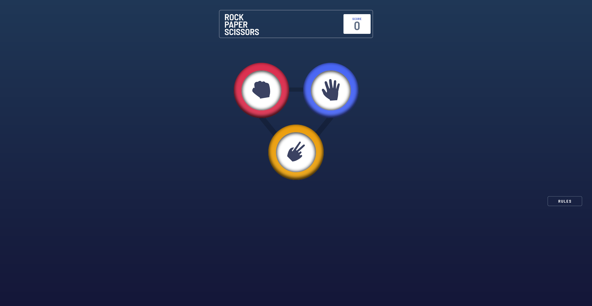

# Rock, Paper, Scissors
This is a Frontend mentor challenge wich helped to apply OOP by developing a rock-paper-scissors game.

---

## Screenshot

## Live Demo

- Live site url: https://devnielote.github.io/rock-paper-scissors/

---

## Project Purpose

This project helped consolidate concepts as:

- OPP principles such as encapsulation and abstraction using `classes`, `interfaces` and `access modifiers`
- TypeScript features like `type aliases`, `interfaces` to build type-safe code
- The game is split into modules, allowing each part to be handled independently
- Used Vite for local development and building

---

## Built with

- TypeScript
- Vite
- Node.js
- Pure CSS
